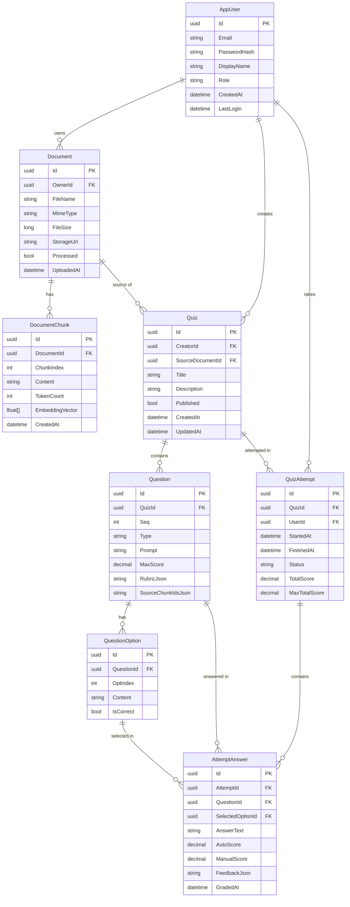

## Mô tả ERD - QuizAI

### Các bảng

**AppUser** - Người dùng hệ thống. Có 2 role: `student` (học viên) và `admin/creator`. Lưu thông tin đăng nhập, tên hiển thị và thời điểm đăng nhập cuối.

**Document** - Tài liệu do user upload lên. Có thể là file `.txt`, `.pdf`, `.docx` hoặc URL web. `StorageUrl` trỏ tới Cloudinary (file) hoặc URL gốc (web). `Processed = true` khi đã extract text xong, nhưng không đảm bảo có chunks (có thể extract ra rỗng).

**DocumentChunk** - Tài liệu được cắt nhỏ thành từng đoạn (~1800 ký tự) để phù hợp với giới hạn context của AI. `EmbeddingVector` là vector số thực dùng cho semantic search (tìm đoạn liên quan nhất khi gen câu hỏi).

**Quiz** - Bộ câu hỏi. Được tạo thủ công hoặc sinh tự động từ Document qua OpenAI. `Published = false` là bản nháp, chỉ creator mới xem và làm được. `Published = true` thì public cho mọi người.

**Question** - Câu hỏi trong Quiz. `Type` có thể là `mcq` (trắc nghiệm), `true_false`, `fill_blank`. `RubricJson` chứa đáp án/tiêu chí chấm điểm. `SourceChunkIdsJson` lưu id các chunk đã dùng để sinh câu hỏi này.

**QuestionOption** - Các lựa chọn của câu hỏi MCQ. `IsCorrect = true` đánh dấu đáp án đúng. Câu `true_false` và `fill_blank` không có options.

**QuizAttempt** - Một lần làm bài của user. `Status`: `in_progress` → `graded`. `TotalScore` và `MaxTotalScore` lưu kết quả sau khi chấm.

**AttemptAnswer** - Câu trả lời của user cho từng câu hỏi trong một lần làm bài. `SelectedOptionId` dùng cho MCQ/TrueFalse. `AnswerText` dùng cho fill_blank. `AutoScore` là điểm tự động, `ManualScore` cho phép giáo viên chấm tay lại.

---

### Quan hệ

| Quan hệ | Ý nghĩa |
|---|---|
| AppUser → Document | 1 user upload nhiều tài liệu |
| AppUser → Quiz | 1 user tạo nhiều bộ quiz |
| AppUser → QuizAttempt | 1 user làm bài nhiều lần |
| Document → DocumentChunk | 1 tài liệu chia thành nhiều chunks |
| Document → Quiz | 1 tài liệu là nguồn sinh ra nhiều quiz |
| Quiz → Question | 1 quiz có nhiều câu hỏi |
| Quiz → QuizAttempt | 1 quiz được nhiều người làm |
| Question → QuestionOption | 1 câu hỏi có nhiều lựa chọn (MCQ) |
| Question → AttemptAnswer | 1 câu hỏi được trả lời trong nhiều attempt |
| QuizAttempt → AttemptAnswer | 1 lần làm bài có nhiều câu trả lời |
| QuestionOption → AttemptAnswer | 1 option có thể được chọn bởi nhiều user |