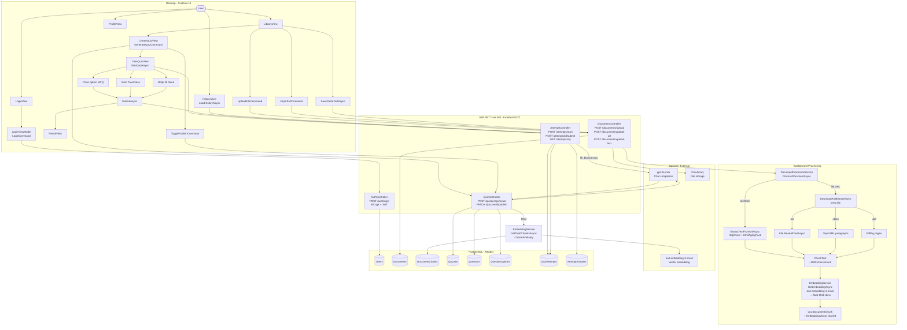
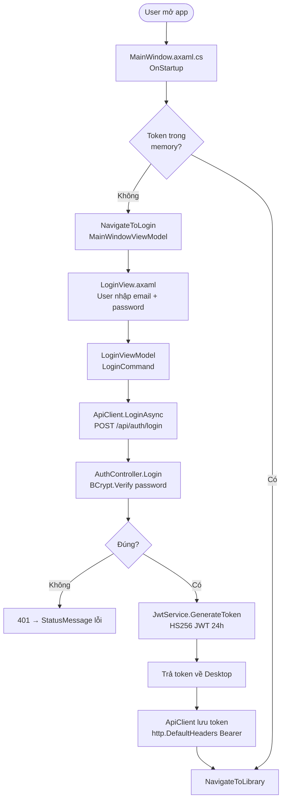
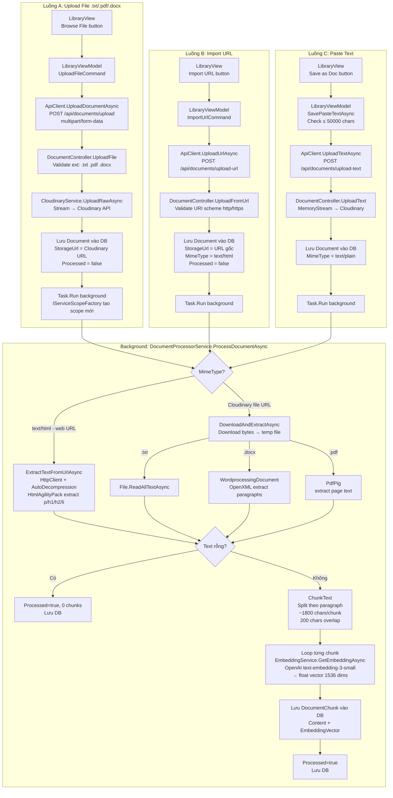
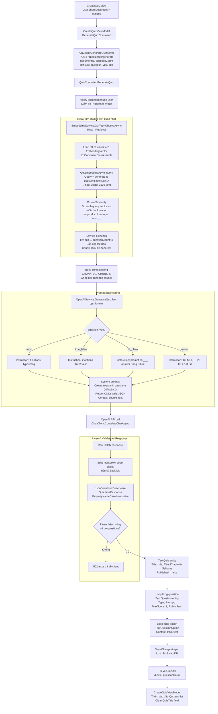
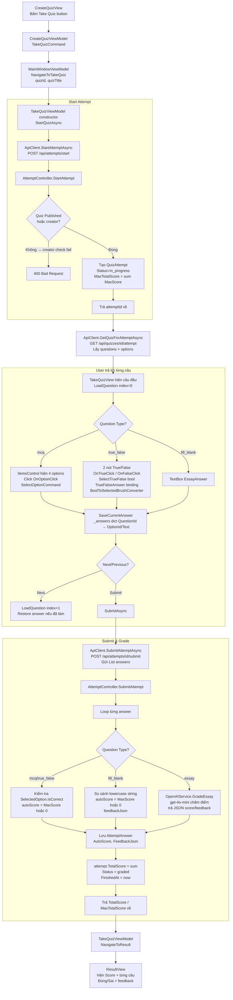
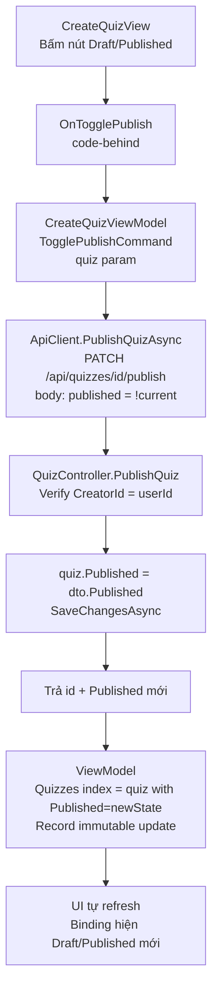
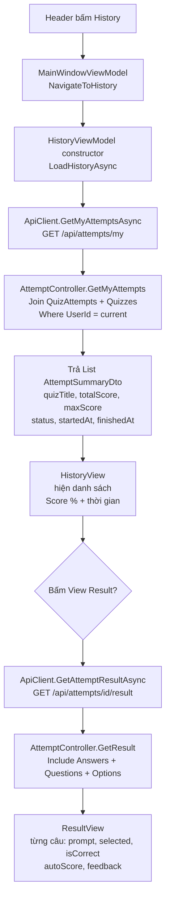

## 0. Overview - Toàn bộ luồng

---

## 1. Auth Flow

---

## 2. Upload Document Flow

---

## 3. Generate Quiz Flow

---

## 4. Take Quiz & Submit Flow

---

## 5. Publish Quiz Flow

---

## 6. History Flow

