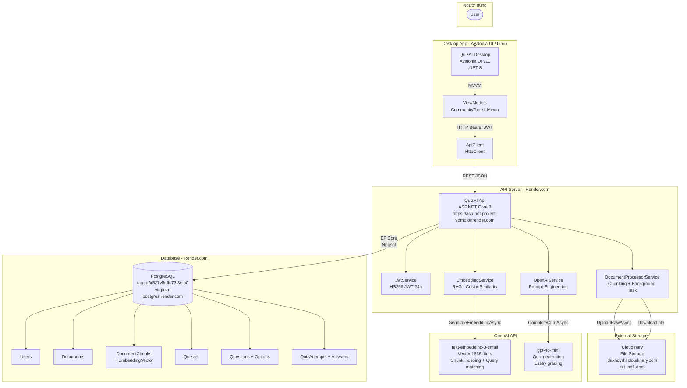

## System Architecture Overview

---

## Tech Stack

| Layer | Công nghệ | Hosting |
|---|---|---|
| Desktop UI | Avalonia UI v11, .NET 8, MVVM | Local machine |
| API Backend | ASP.NET Core 8, EF Core 8 | Render.com (free tier) |
| Database | PostgreSQL 16 | Render.com |
| File Storage | Cloudinary (raw upload) | Cloudinary CDN |
| AI - Embedding | OpenAI text-embedding-3-small | OpenAI API |
| AI - Quiz Gen | OpenAI gpt-4o-mini | OpenAI API |
| Auth | JWT Bearer HS256, BCrypt | - |
| ORM | Entity Framework Core + Npgsql | - |
